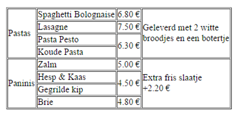
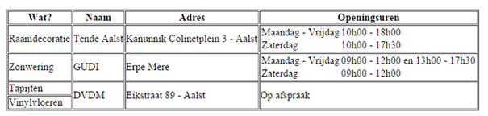
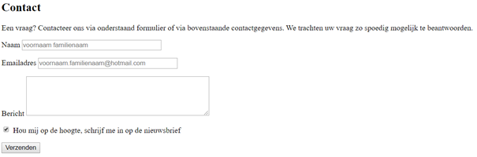

# Oefeningen hoofdstuk 3: Tabellen en formulieren

Download of clone deze repository. Hiervoor klik je op de groene knop.

Pak deze zip uit in de map waar je alle leermateriaal van Webapplicaties I plaatst.

Ga nu naar Visual Studio Code en open deze map.

## OEFENING 1: het betere drilwerk.
De eerste oefening bevat 3 kleine oefeningen om de basistags te leren gebruiken.

Maak eerst een map in de root aan: **driloefeningen**. 

Om de structuur van een html pagina snel aan te maken in de editor, gebruik je emmet (!tab).

De bedoeling is de correcte html te schrijven om onderstaande screenshots in je browser weer te geven.

- Dril 01: tabel1.html

    

- Dril 02: tabel2.html

    

- Dril 03: form1.html

    
