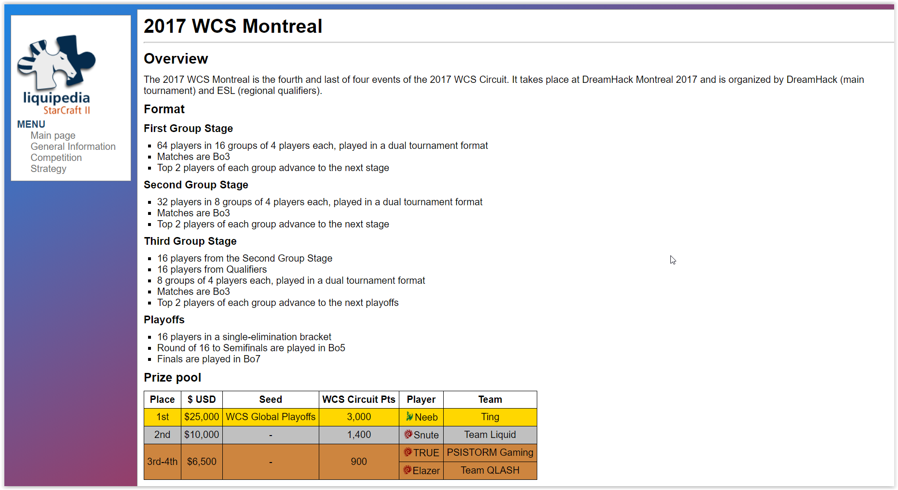

# Oefeningen hoofdstuk 3: Tabellen en formulieren

Download of clone deze repository. Hiervoor klik je op de groene knop.

Pak deze zip uit in de map waar je alle leermateriaal van Webapplicaties I plaatst.

Ga nu naar Visual Studio Code en open deze map.

## OEFENING 1: kleine oefeningen.
De eerste oefening bevat 4 kleine oefeningen om tabellen en formulieren in webpagina's aan te maken.

Maak eerst een map in de root aan: **driloefeningen**. 

Om de structuur van een html pagina snel aan te maken in de editor, gebruik je emmet (!tab).

Schrijf correcte html, eventueel testen op https://validator.w3.org/, om onderstaande screenshots in je browser weer te geven.

- Dril 01: tabel1.html

    

- Dril 02: tabel2.html

    

- Dril 03: form1.html

    

    Zorg ervoor dat als je op de tekst (label) van een formulier element klikt, je focus krijgt in het overeenkomende formulier element.      
    Naam en e-mail zijn verplichte velden.     
    Het formulier wordt verstuurd met de POST method naar *je hogent-account e-mailadres* met als onderwerp **Aanvraag**       

    

- Dril 04: form2.html

    
    

Zorg ervoor dat als je op de tekst (label) van een formulier element klikt, je focus krijgt in het overeenkomende formulier element.      
Naam, geboortedatum en land zijn verplichte velden.     
Het formulier wordt verstuurd met de POST method naar *je hogent-account e-mailadres* met als onderwerp **Aanvraag**         

-----

## OEFENING 2: Likwiepedia.
De Likwiepedia die in deze oefening gemaakt wordt is een eenvoudigere versie van de Liquipedia pagina voor het WCS Montreal. De focus ligt op het nabouwen van verschillende tabellen die op deze pagina te vinden zijn.
De afgewerkte site (met css - volgend hoofdstuk) zal er als volgt uitzien:

Eindresultaat van de tabellen zonder css.

Maak eerst de **Prize pool** tabel, zoals hieronder. 

Tip: gebruik voor alle tabellen het table *attribuut* **border="1"** om de borders zichtbaar te maken, zoals hieronder weergegeven. Als de tabel klaar is verwijder je het attribuut opnieuw.      

Vervolgens de **Participant** table

Tot slot de **Distribution** table

------

## OEFENING 3: BolDotCom.
De bedoeling van deze oefening is om het registratieformulier van de bol.com webwinkel na te bouwen. Het uiteindelijke resultaat moet er als volgt uitzien:    

Zonder css:

Met css:

**Algemene beschrijving**
Het formulier waarin de accountgegevens worden ingevuld bestaat uit 3 fieldsets: 
- 1 voor de persoonlijke gegevens, 
- 1 voor de inloggegevens 
- 1 waarin de gebruiker kan aangeven welke nieuwsbrieven hij/zij wilt ontvangen. 

We bouwen ze stuk voor stuk op.

**Persoonlijke gegevens**     
1. Voeg om te beginnen een form element toe in de main. Alle fieldsets komen hierin te staan.
2. Voeg binnen het formulier een eerste fieldset toe. Deze heeft als legend “Persoonlijke gegevens”.
3. Voeg de verschillende form controls toe. Elk komt binnen een eigen paragraaf te staan, behalve voornaam/achternaam en straatnaam/huisnummer en bus: die staan per twee. Elk element moet ook een label krijgen: als op het label van een veld geklikt wordt springt de cursor naar het bijhorende invoerveld.
    - De aanhef bestaat uit 2 radio buttons. Deze hebben als name “aanhef”. De gebruiker is verplicht een keuze te maken. Standaard is “Mevrouw” geselecteerd.
    - De voornaam en achternaam zijn gewone inputvelden. Hun name is respectievelijk “voornaam” en “achternaam”. Beide zijn verplicht.
    - De bedrijfsnaam is ook een gewoon tekstveld, met name “bedrijfsnaam”. Niet verplicht.
    - Postcode en gemeente is een gewoon tekstveld, met name “postcode_gemeente”. Verplicht in te vullen.
    - Straatnaam en huisnummer en bus zijn twee aparte tekstvelden. Beide zijn verplicht. Kies zelf een gepaste name voor beide.
    - Land is een drop down list. De gebruiker kan kiezen tussen “België” en “Nederland”. Kies zelf logische waarden voor het name en value attribuut. Standaard is “België” geselecteerd. Men is verplicht een land te kiezen.
    - De extra adresregel is weer een gewoon tekstveld en moet niet ingevuld worden. Kies een logische name.
    - De geboortedatum is een date-veld. Moet niet ingevuld worden.
    - Het telefoonnummer moet verplicht ingevuld worden. Gebruik type “number” zodat de gebruiker enkel cijfers kan invoeren.

    

**Inloggegevens**
1. Voeg een nieuwe fieldset toe voor de Inloggegevens. Zorg voor de juiste titel in de legend.
2. Voeg de form controls toe
    - Het emailadres is verplicht in te vullen. Gebruik het correcte type zodat enkel geldige emailadressen aanvaard zullen worden. Zet een placeholder met daarin een voorbeeldemailadres.
    - Wachtwoord moet ook verplicht ingevuld worden. Gebruik hier ook het gepaste type zodat sterretjes getoond worden in plaats van het wachtwoord. Gebruik hier ook een placeholder om aan de gebruiker te laten weten dat het wachtwoord minstens 8 tekens moet bevatten. Een check of dit inderdaad het geval is voegen we echter niet toe.

    

**Nieuwsbrief**
1. Voeg de laatste fieldset toe voor de nieuwsbrieven. Deze heeft geen legend.
2. De selectie voor de nieuwsbrieven staat binnen een tabel. Deze bestaat uit 3 rijen en 2 kolommen. De bovenste rij bevat de hoofdingen, de twee volgende rijen bestaan uit een cel met een checkbox en een cel met de uitleg van de bijhorende nieuwsbrief. Beide checkboxen zijn standaard aangevinkt.
3. Voeg tenslotte nog een *verzenden* knop toe.

    